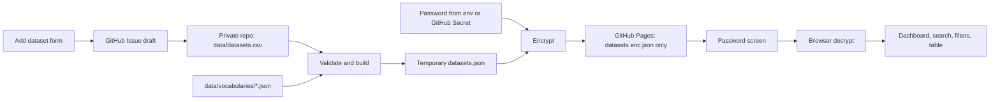

# Sequencing Dataset Catalog Design

Date: 2026-06-01

## 1. Purpose

Build a lightweight, private, GitHub Pages-hosted catalog for personally curated public sequencing datasets.

The catalog records dataset-level metadata for sources such as GEO, SRA, ENA, TCGA, publication supplements, Zenodo, Figshare, and author-hosted data pages. It does not store raw sequencing files such as FASTQ, BAM, CRAM, count matrices, or analysis outputs.

The main use case is to search and filter curated public sequencing datasets by biological and technical metadata, including disease, species, tissue, sequencing type, data source, and download status.

## 2. Scope

### In scope

- Dataset-level records only.
- CSV as the human-maintained source of truth.
- Static web app deployed through GitHub Pages.
- Private repository for source data and scripts.
- Encrypted published dataset file for browser-side decryption.
- Search, facet filtering, sorting, table display, and summary statistics.
- Web form for adding dataset records by generating GitHub Issue drafts.
- Controlled vocabulary plus optional ontology identifiers.
- Optional lightweight download status field.

### Out of scope for MVP

- Backend database.
- User accounts or server-side authentication.
- Sample-level, run-level, or file-level records.
- Analysis workflow tracking.
- Independent dataset detail pages.
- Direct browser writes to the GitHub repository.
- Hosting or managing raw sequencing files.

## 3. Architecture

The system uses a static-site architecture with a private source repository and encrypted public data artifact.



### Privacy model

- The repository should be private.
- `data/datasets.csv` stays in the private repository.
- The deployed site publishes only encrypted dataset data, not a plaintext JSON export.
- The password is not committed to the repository and is not embedded in frontend code.
- The password is supplied during encryption through a local environment variable or GitHub Actions Secret.
- The browser asks for the password and decrypts the dataset locally.

This protects the curated metadata: disease labels, tissue annotations, notes, download status, and personal judgments about dataset usefulness. The original public sequencing datasets remain publicly accessible at their source databases.

## 4. Data model

Each row in `data/datasets.csv` represents one dataset-level record. A record may correspond to a GEO Series, SRA/ENA project, BioProject, TCGA cohort, Zenodo/Figshare dataset, paper supplement, author-hosted dataset, or publication-only source.

### Core fields

| Field | Required | Description | Example |
|---|---:|---|---|
| `id` | yes | Internal unique ID | `ds_0001` |
| `title` | yes | Dataset title | `Single-cell atlas of human lung fibrosis` |
| `summary` | no | Short dataset summary | `scRNA-seq of IPF and control lung tissues` |
| `source_type` | yes | Main source type | `GEO`, `SRA`, `ENA`, `TCGA`, `Publication` |
| `accessions` | conditional | Dataset accessions | `GSE12345; SRP123456` |
| `data_links` | conditional | One or more labeled links | `GEO=https://...; Supplement=https://...` |
| `species` | yes | Species labels | `Homo sapiens; Mus musculus` |
| `diseases` | yes | Disease or biological condition labels | `idiopathic pulmonary fibrosis; normal control` |
| `tissues` | yes | Tissue or sample-origin labels | `lung; peripheral blood` |
| `sequencing_types` | yes | Standard sequencing type labels | `scRNA-seq; bulk RNA-seq` |
| `technology_tags` | no | Free technical tags | `10x Genomics; Illumina NovaSeq; paired-end` |
| `sample_count` | no | Dataset-level sample count summary | `32` |
| `download_status` | no | Lightweight download status | `not downloaded` |
| `notes` | no | Free notes | `Only fibroblast-enriched samples are relevant.` |

At least one of the following source-traceability fields must be present: `accessions`, `data_links`, `doi`, or `pmid`.

### Publication fields

| Field | Required | Description | Example |
|---|---:|---|---|
| `pmid` | no | PubMed ID | `34567890` |
| `doi` | no | DOI | `10.1038/s41586-...` |
| `paper_title` | no | Associated paper title | `A single-cell atlas of...` |
| `journal` | no | Journal name | `Nature` |
| `year` | no | Publication year | `2024` |
| `corresponding_author` | no | Corresponding author, lab, or group | `Zhang Lab` |

### Optional future fields

These fields are reserved for later use or can be represented in `notes` during the MVP.

| Field | Purpose |
|---|---|
| `disease_ontology_ids` | MONDO, DOID, or related disease ontology IDs |
| `tissue_ontology_ids` | UBERON or related tissue ontology IDs |
| `species_taxonomy_ids` | NCBI Taxonomy IDs |
| `platform` | Sequencing platform, such as Illumina NovaSeq 6000 |
| `library_strategy` | SRA-like library strategy, such as RNA-Seq or WGS |
| `has_raw_data` | Whether raw FASTQ/BAM/CRAM data are available |
| `has_processed_data` | Whether processed matrices or tables are available |
| `license_or_access` | Open, controlled access, supplement only, request required |

### Multi-value convention

CSV multi-value fields use semicolon-separated values.

Examples:

```text
Homo sapiens; Mus musculus
GSE12345; SRP123456
GEO=https://www.ncbi.nlm.nih.gov/geo/query/acc.cgi?acc=GSE12345; Paper=https://example.org/paper
```

The build script converts these fields into JSON arrays. `data_links` is converted into an array of labeled link objects.

## 5. Controlled vocabularies

Controlled vocabulary files live under `data/vocabularies/`.

Controlled fields:

- `species`
- `diseases`
- `tissues`
- `sequencing_types`
- `source_type`
- `download_status`

The vocabulary system uses standard display names plus aliases. The frontend displays standard names, while the build script can normalize aliases.

### Sequencing type vocabulary

Standard display names should prefer common bioinformatics abbreviations.

| Standard display name | Aliases or full names |
|---|---|
| `bulk RNA-seq` | `RNA-seq`, `bulk transcriptomics` |
| `scRNA-seq` | `single-cell RNA-seq`, `single cell RNA-seq` |
| `snRNA-seq` | `single-nucleus RNA-seq`, `single nucleus RNA-seq` |
| `spatial transcriptomics` | `spatial RNA-seq`, `Visium`, `Stereo-seq` |
| `WGS` | `whole-genome sequencing` |
| `WES` | `whole-exome sequencing` |
| `ATAC-seq` | `bulk ATAC-seq` |
| `scATAC-seq` | `single-cell ATAC-seq` |
| `ChIP-seq` | `chromatin immunoprecipitation sequencing` |
| `CUT&Tag` | `cleavage under targets and tagmentation` |
| `CUT&RUN` | `cleavage under targets and release using nuclease` |
| `miRNA-seq` | `microRNA sequencing` |
| `metagenomics` | `metagenomic sequencing` |
| `long-read RNA-seq` | `Iso-Seq`, `Nanopore direct RNA` |
| `long-read WGS` | `PacBio HiFi WGS`, `ONT WGS` |
| `other` | custom or uncommon assay types |

`technology_tags` remains free text and records details such as `10x Genomics`, `Smart-seq2`, `Visium`, `paired-end`, `PacBio HiFi`, or `Illumina NovaSeq`.

## 6. Web app layout

The app is a single-page catalog. There are no dataset detail pages in the MVP.

### Page sections

1. Password unlock screen
   - Initial page view shows only a password input.
   - On successful decryption, the dashboard is displayed.
   - On failure, show: `密码错误或数据文件损坏`.

2. Header
   - Title: `Sequencing Dataset Catalog`.
   - Subtitle: `A private searchable catalog for public sequencing datasets`.

3. Summary statistics
   - Cards:
     - total datasets
     - disease count
     - species count
     - downloaded dataset count
   - Charts:
     - sequencing type distribution
     - disease Top 10 bar chart

4. Search and filters
   - Keyword search input.
   - Facet filters:
     - disease
     - species
     - tissue
     - sequencing type
     - source type
     - download status
   - Reset filters button.

5. Dataset table
   - One row per dataset.
   - Sortable columns.
   - Pagination or virtual scrolling if needed.
   - Clickable external data links.
   - Long notes can be truncated with inline expansion.

6. Add dataset entry point
   - Button: `Add dataset`.
   - Opens a form and generates a GitHub Issue draft.

### Default table columns

| Column | Description |
|---|---|
| `title` | Dataset title |
| `source_type` | Main data source |
| `accessions` | GSE, SRP, ERP, DRP, PRJNA, TCGA cohort, or similar |
| `diseases` | Disease or condition labels |
| `species` | Species labels |
| `tissues` | Tissue labels |
| `sequencing_types` | Standard assay labels, such as `scRNA-seq` |
| `sample_count` | Dataset-level sample count |
| `year` | Publication year |
| `download_status` | Lightweight download status |
| `data_links` | External links |
| `notes` | Truncated note text with optional expansion |

### Search behavior

Keyword search covers:

- `title`
- `summary`
- `accessions`
- `pmid`
- `doi`
- `paper_title`
- `journal`
- `diseases`
- `species`
- `tissues`
- `sequencing_types`
- `technology_tags`
- `notes`

Facet logic:

- Different fields use AND logic.
- Multiple selected values within the same field use OR logic.

Example:

```text
species = Homo sapiens
AND sequencing_type = scRNA-seq
AND disease = IPF OR COPD
```

## 7. Add dataset workflow

The web app provides a form for adding dataset records. The form does not write to the repository directly. It validates input, normalizes fields, previews the record, and opens a GitHub Issue draft.


### Form groups

1. Dataset basics
   - `title`
   - `summary`
   - `source_type`
   - `accessions`
   - `data_links`

2. Biological metadata
   - `species`
   - `diseases`
   - `tissues`
   - `sequencing_types`
   - `technology_tags`
   - `sample_count`

3. Publication
   - `pmid`
   - `doi`
   - `paper_title`
   - `journal`
   - `year`
   - `corresponding_author`

4. Status and notes
   - `download_status`
   - `notes`

### Form behavior

- Controlled fields use autocomplete.
- Multi-value fields use tag inputs.
- Sequencing type aliases normalize to the standard abbreviation, such as `single-cell RNA-seq` to `scRNA-seq`.
- Data links are entered as repeated `label + url` pairs.
- The form shows a generated record preview before opening the issue.
- If GitHub Issue link generation fails, the app displays copyable CSV and Markdown content.

### GitHub Issue content

The issue title should follow:

```text
Add dataset: <dataset title>
```

The issue body includes:

- A CSV row preview.
- A JSON preview.
- Notes for manual review.

## 8. Validation and build

Validation should run locally and in GitHub Actions before encryption.

### Required fields

MVP required fields:

- `id`
- `title`
- `source_type`
- `species`
- `diseases`
- `tissues`
- `sequencing_types`

At least one source-traceability field is required:

- `accessions`
- `data_links`
- `doi`
- `pmid`

### Format rules

- `id` must be unique and match a stable format such as `ds_0001`.
- `source_type` must exist in its vocabulary.
- `sequencing_types` must normalize to standard labels.
- `download_status`, if present, must exist in its vocabulary.
- `sample_count`, if present, must be a positive integer.
- `year`, if present, must be a plausible publication year.
- `pmid`, if present, must contain only digits.
- `doi`, if present, must roughly match DOI syntax.
- `data_links` URLs must be parseable.
- Multi-value fields must parse cleanly.

### JSON output

The build script outputs a temporary plaintext JSON structure before encryption.

Example:

```json
[
  {
    "id": "ds_0001",
    "title": "Single-cell atlas of human lung fibrosis",
    "sourceType": "GEO",
    "accessions": ["GSE12345"],
    "species": ["Homo sapiens"],
    "diseases": ["idiopathic pulmonary fibrosis"],
    "tissues": ["lung"],
    "sequencingTypes": ["scRNA-seq"],
    "technologyTags": ["10x Genomics"],
    "dataLinks": [
      {
        "label": "GEO",
        "url": "https://example.org"
      }
    ],
    "publication": {
      "pmid": "34567890",
      "doi": "10.1038/example",
      "title": "Example paper title",
      "journal": "Nature",
      "year": 2024
    },
    "downloadStatus": "not downloaded",
    "notes": "Example note"
  }
]
```

## 9. Encryption and unlock flow

The deployed site should not include plaintext `datasets.json`.

### Encryption format

The encrypted file is published as:

```text
public/datasets.enc.json
```

Recommended structure:

```json
{
  "version": 1,
  "kdf": "PBKDF2",
  "iterations": 310000,
  "salt": "base64...",
  "algorithm": "AES-GCM",
  "iv": "base64...",
  "ciphertext": "base64..."
}
```

### Password handling

- Local build password source: `DATASET_CATALOG_PASSWORD` environment variable.
- GitHub Actions password source: GitHub Actions Secret.
- The password is never committed.
- The password is never embedded in frontend JavaScript.

### Browser unlock flow

1. Fetch `datasets.enc.json`.
2. Ask the user for the password.
3. Derive a key with Web Crypto API.
4. Decrypt with AES-GCM.
5. Parse the decrypted JSON.
6. Render statistics, search, filters, and table.
7. If decryption fails, show only: `密码错误或数据文件损坏`.

## 10. Error handling

- CSV validation failure: fail the build and report row number plus field name.
- Missing required field: fail validation.
- Unknown controlled vocabulary value: fail validation unless configured as an allowed alias.
- Bad password or corrupt encrypted file: show a generic frontend error.
- Chart rendering failure: keep the table usable.
- GitHub Issue URL too long or generation failure: show copyable Markdown and CSV output.

## 11. Testing strategy

### Data validation tests

- Missing required field fails.
- Duplicate `id` fails.
- Invalid sequencing type fails or fails to normalize.
- Invalid URL, PMID, year, or sample count fails.
- Records with no accession but valid DOI, PMID, or data link pass.

### Build tests

- Example CSV generates expected JSON.
- Semicolon-separated fields become arrays.
- `data_links` becomes labeled link objects.
- Sequencing type aliases normalize to display abbreviations.

### Encryption tests

- Correct password decrypts successfully.
- Wrong password fails.
- Build output does not publish plaintext `datasets.json`.

### Frontend tests

- Locked page hides catalog content.
- Correct password displays the dashboard and table.
- Keyword search works.
- Facet filters work.
- Reset filters works.
- Add dataset form generates a usable GitHub Issue draft or copyable fallback.

## 12. Implementation notes

A minimal implementation can use a static frontend framework or plain Vite-based JavaScript. The key requirement is to keep the data pipeline simple:

1. Edit `data/datasets.csv`.
2. Validate and build JSON.
3. Encrypt JSON.
4. Deploy only encrypted data and static frontend files.

The first version should optimize for maintainability of curated biological metadata rather than complex backend features. Future work can add accession-based import scripts, ontology lookup helpers, and issue-to-CSV automation.
